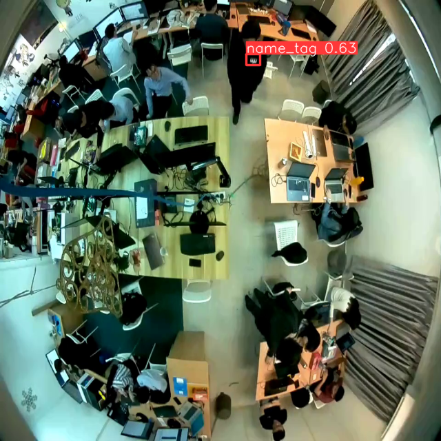
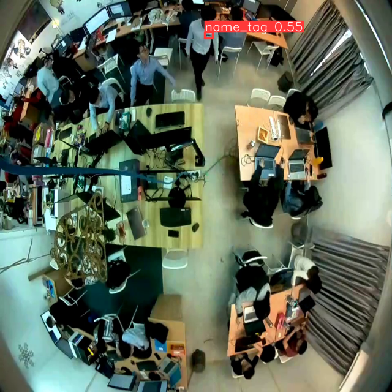

# Assesment
This project it use YOLOv8 to define the object detection in name_tag. 

DATASET can retreive from https://drive.google.com/drive/folders/15D-fhBIEtROtYetATHPvObkOuq7x_Qn6?usp=sharing
## Set up Environment
1. Set up environment and activate

    ```conda create [name] ```

    ```conda activate [name]```

2. Install the dependency

    ```pip install -r requirements.txt```

3. Train the model
   
   ```python train.py```

5. Run the test images and modify it from ```test.py```

    ```python test.py```

    ```results = model(['your images/video name'], stream=True, save_conf=True, save=True, conf=0.4, save_txt=True, imgsz=640) ```


## Screenshot





